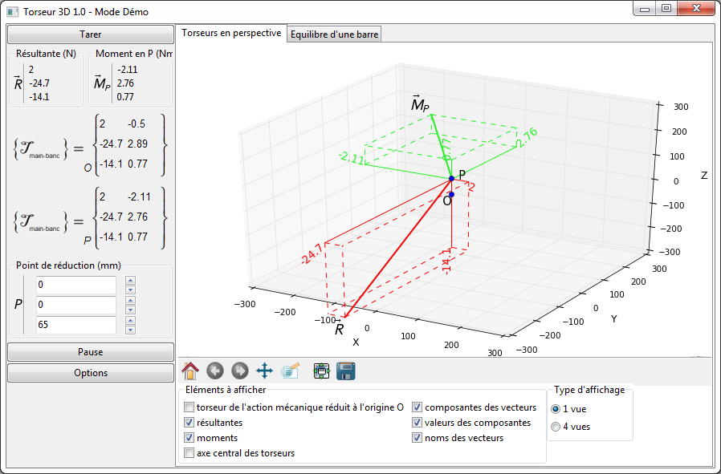

# torseur3d
_Acquisition numérique et affichage d'actions mécaniques 3D_

_**Torseur3D**_ est un logiciel d'acquisition numérique et affichage d'actions mécaniques 3D.
Il possède plusieurs modes de fonctionnement :
 * utilisation du banc "maison" (en cours de développement)
 * mode manuel : modification des composantes de l'effort appliqué depuis l'interface
 * utilisation du banc de mesure "Torseur3D" commercialisé par la société JEULIN (il y a quelques années !)

## Fonctionnalités ##

## Développement ##

Développé par Cédrick FAURY

avec l'aide indispensable d'Eric Brun sans qui je serais encore en train d'essayer d'établir une connexion série avec le banc ...
Fonctionnalités

Affichage du torseur de l'action mécanique exercée sur le banc, sous la forme des deux vecteurs composantes (résultante et moment), en perspective.
Réduits au centre du banc et/ou en tout autre point de réduction.

Fonction de zoom (roulette de la souris), de centrage autour d'un point (clic sur le point) et de rotation de la vue.

Affichage des composantes des vecteurs et de leurs valeurs. 	
Nouveau ! Affichage de l'axe central du torseur et affichage possible en 4 vues (3 projections orthogonales et 1 perspective)	
Exercice de mise et surtout maintien en équilibre d'une barre virtuelle...
pas facile au début !

De nombreux paramètres sont modifiables. 	

## Téléchargement ##

[Anciennes versions]()
